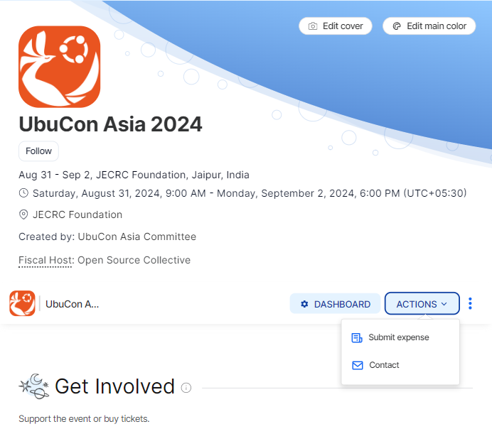
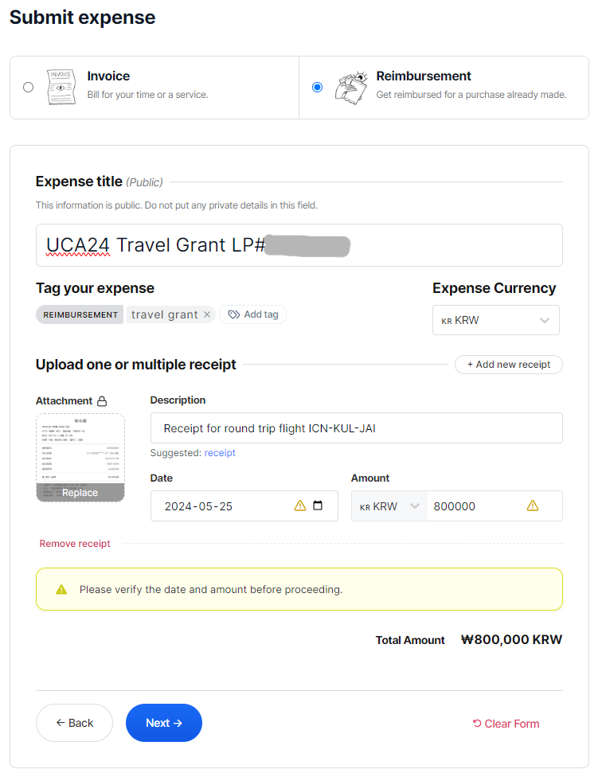
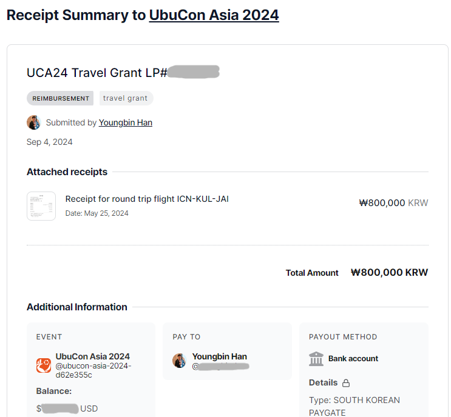
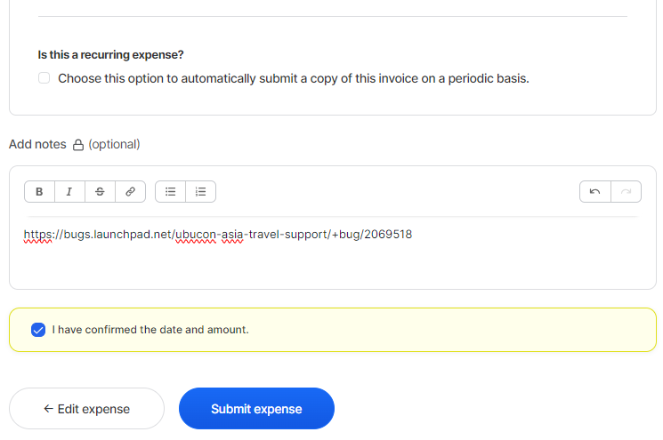

# Travel grant

For those who have difficulties raising funds for travel to the host city(or country) for attending UbuCon Asia, The Committee provides travel grant for selected applicants. Grants are provided in 2 categories.

## Travel grant for round trip
The committee can provide funding for round trip between your home and the hosting city(or country). Which is usually flight, train, ferry or other inter-city or international transportation. To minimize risks and provide funding for as many people as possible, The committee provides funding for your round trip as reimbursement after the event is finished. This means, that even if you got your grant approval, you will need to book your round trip ticket with your own money first. Then we'll provide reimbursement for that after the event. 

## Accommodations support
The committee can provide accommodation to selected applicants during the event period. In case the committee have secured large blocks of accommodations in advance, you will be assigned to a room and receive confirmation for your accommodation along with some instructions. There could be also cases where the committee did not secure rooms before. In that case, the committee will ask you to book accommodation with your own money and then provide reimbursement after the event.

## Grant priority
Since our budget is always limited, We won't be able to approve everyone who applies. Thus, we'll be approving applicants with consideration on the level of needs the applicant stated in the application and also following priority order.

1. Keynote/Talk/Workshop Speakers* & Organizers
2. Official Ubuntu Members, BoF Moderators(Those who submitted BoF proposal then got selected)*, On-site Volunteers with full time commitment(Selected in advance)
3. Attendees, Lightning talk speakers(In case we accept proposals for Lightning talks earlier in advance)

> - *For sessions with multiple speakers, Up to 2 speakers in the same session will be eligible for this order

## Applying for travel grant
To apply for travel grant, You'll need to fill in the application form below. You'll also need to attach the following files for review.

- If you're applying for round trip funding: Proof of expense estimation such as travel pricing searches or invoice if you already booked one.
- If you're applying for accommodation and need to book one by yourself: Proof of expense estimation such as travel pricing searches or invoices if you already booked one.

```
# Profile
## Name(Full name as stated in your passport or national ID)

## Affiliation
(If you have any, Example are community affiliation such as Ubuntu LoCo Council, Debian Projects, your work affiliation or other affiliation)

## Participation type
Please choose one of: Keynote/Talk/Workshop speaker, Organizing committee, Attendee

## Are you an Ubuntu Member?
Please choose one of: Yes, No

## Your Launchpad.net profile link

## Your GitHub profile link

## Detailed description of your contribution to this year's UbuCon Asia

## What are your contributions to the Ubuntu project or Ubuntu Community?

## What are your activity plans before, during and after UbuCon Asia?

## Are there anything you would like to achieve through this year's UbuCon Asia?

# Travel grant for round trip
## Do you need travel grant for round trip?
Enter Yes or No: 
 
## Type of transportation (such as Flight, Train, Ferry, Express Bus or other)

## Your travel itinerary
(e.g. Arrival: In HAN from ICN on August 30th, Departure: From HAN to ICN on September 3rd)

## Estimated total expense in USD

## Please attach proof for the estimated amount above (Such as travel pricing searches, Or an Inoice if you already booked one)
What is the name of the file you've attached?: 

## Level of needs for round trip funding
Please enter a number from the list below:
1. Without this travel grant, I will never be able to attend this event in-person. 
2. Without this travel grant, I will have to make financial sacrifices to attend in-person. 
3. Without this travel grant, It will be inconvenient for me, But no problem to attend. 
4. I will be still able to join without this travel grant, As I can raise travel funding in other ways.

# Travel grant for accommodation
## Do you need a travel grant for accommodation?
Enter Yes or No: 

## Your check-in and check-out schedule
(e.g. Check-in at Aug 30, Check-out at Sep 3)

## In case you'll need to book accommodation by yourself, Enter the estimated total expense in USD

## In case you'll need to book accommodation by yourself, Please attach proof for the estimated amount above
(Such as travel pricing searches, Or an Inoice if you already booked one)
What is the name of the file you've attached?: 

## Level of needs for accommodation support
Please enter a number from the list below:
1. Without this travel grant, I will never be able to attend this event in-person. 
2. Without this travel grant, I will have to make financial sacrifices to attend in-person. 
3. Without this travel grant, It will be inconvenient for me, But no problem to attend. 
4. I will be still able to join without this travel grant, As I can raise travel funding in other ways.

# Any comments or questions to the committee?
```

Once the application is prepared, please submit it by filing a bug on Launchpad. [You may start filing a bug by clicking a link here.](https://bugs.launchpad.net/ubucon-asia-travel-support/+filebug)

- For `Summary` field, enter `[Travel grant - UbuCon Asia <Year>] - <Your name>`. (e.g. `[Travel grant - UbuCon Asia 2024] - John Doe`)
- For `Further information` field, copy and paste the full application text you have prepared before.
- For `This bug contains information that is:` option, Make sure to choose `Private`
- To add an attachment, Click `Extra options`. Then choose a file to attach. Unfortunately, Launchpad seem to support only single attachment for each post(a bug description or a comment on bug). To attach multiple attachments, you may add multiple comments with files attached.You can also attach multiple files one by one after the initial submission from the bugs page of launchpad.net by clicking add attachment or patch link.

Once you submit your application by filing a bug, The committee will check and review your application. Committee staff may leave comments to ask questions about your application or to provide updates on your application. The committee will also provide review result (either approved or rejected) by leaving a comment. While leaving comments does give you some email notifications, you'll still need to follow up on such notifications and updates.  

## Claiming your expense (Submitting reimbursement) after the event

After the event, you will be informed to submit reimbursement via Open Collective platform. Committe will give you Open Collective profile link. Opening the link will show you profile page like this. Click `Actions` then choose `Submit expense` to start filling out submission form.



To continue, select `Reimbursement` as you will be reimbursed for expense you've already made. Then choose payout method. You may choose payout method informatino you've registered before or add new one. For currency, make sure to choose one that matches your bank account.



Next, Fill in expense details. Note that total amount must not exceed the approved amount that you've informed from the committee before. 

- Title: `UCA<YY> Travel Grant LP#<LP Bug ID>`
  - Example: `UCA24 Travel Grant LP#1234567
- Tag: `travel grant`
- Click "Add new receipt" to add one.
  - For attachment, upload proof of purchase that shows expense details, dates and amount.
  - For description, enter description of the expense. Such as `Round trip flight for ICN-KUL-JAI`
  - For date, enter date that payment made which should be stated in the attachment you've added.
  - For amount, enter the amount you see in the attachment. You may lower the amount if it exceeds approved amount.



On next screen, review your submission details then add launchpad bug URL for your travel grant application to notes.
Once done and looks all good, click `Submit expense` to submit reimbursement. Committe will review and process your request.



